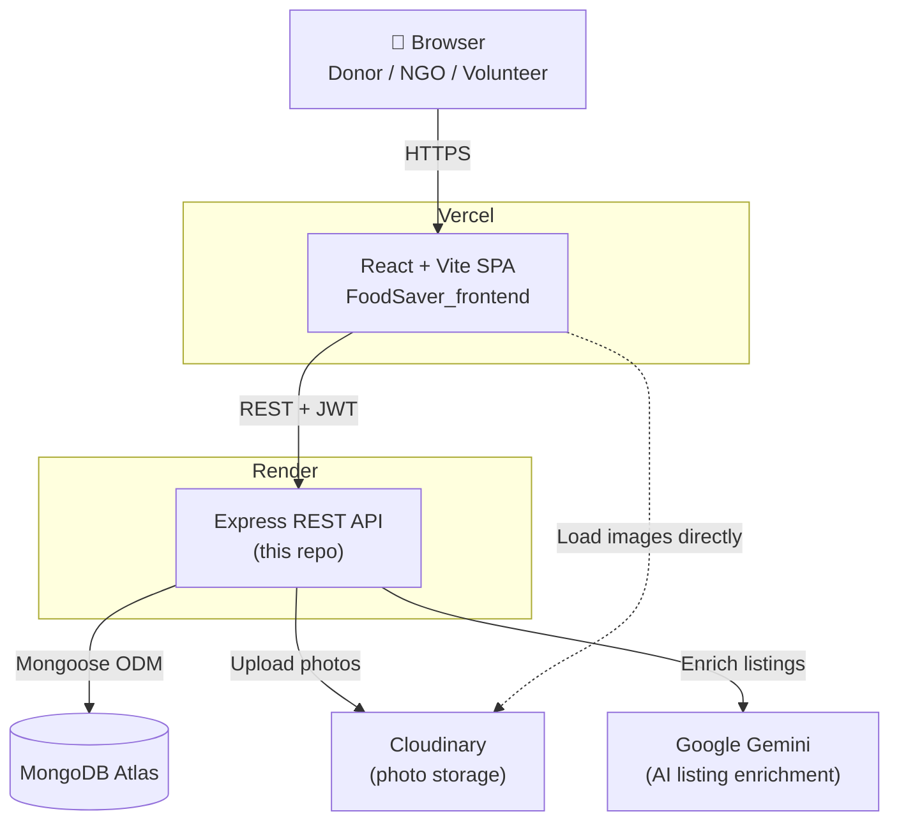
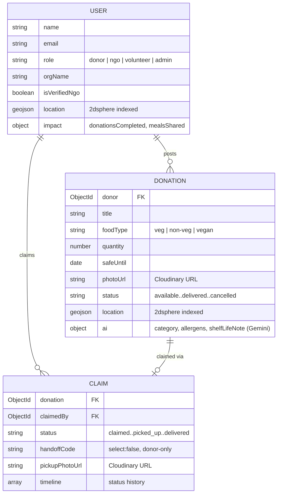
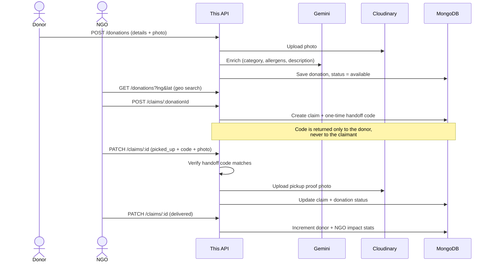

# Food Saver — Backend

Express + MongoDB API for Food Saver, connecting restaurants and individuals
with surplus food to nearby NGOs and volunteers.

**Live API: https://foodsaver-backend-yg57.onrender.com** · **Live app: https://food-saver-frontend-seven.vercel.app/**

Frontend repo: [`FoodSaver_frontend`](https://github.com/Adityaguptawebdev/FoodSaver_frontend) — a static Vite app that talks to this API over HTTP.

<table>
  <tr>
    <td></td>
    <td></td>
  </tr>
</table>

## Stack

- Node.js + Express
- MongoDB (Mongoose)
- Google Gemini (`gemini-2.5-flash`) — AI listing assistant (optional)
- Cloudinary — donation/pickup photo storage

## Local setup

```bash
npm install
cp .env.example .env   # fill in MONGO_URI, JWT_SECRET, etc. — see comments in the file
npm run dev
```

Runs on port `5050` by default. Requires a MongoDB instance (local or Atlas)
and, optionally, Gemini and Cloudinary credentials (the app runs fine without
them — AI tagging and photo storage just no-op/fall back gracefully).

## Deploying (Render)

1. Create a new **Web Service** on Render, pointed at this repo.
2. Build command: `npm install` · Start command: `npm start`.
3. Add environment variables (see `.env.example` for the full list):
   `MONGO_URI`, `JWT_SECRET`, `JWT_EXPIRES_IN`, `GEMINI_API_KEY`,
   `CLOUDINARY_CLOUD_NAME`, `CLOUDINARY_API_KEY`, `CLOUDINARY_API_SECRET`,
   `CLIENT_ORIGIN` (your deployed frontend's URL, for CORS).
   Do **not** set `PORT` — Render sets it automatically and the app reads it.
4. Once deployed, update the frontend's `VITE_API_URL` to point at this
   service's `.onrender.com` URL (with `/api` appended) and redeploy the
   frontend.

Photos are uploaded straight to Cloudinary, not local disk, so they survive
Render's ephemeral filesystem across redeploys/restarts — see
`src/config/cloudinary.js`.

## API overview

- `POST /api/auth/register`, `POST /api/auth/login`, `GET /api/auth/me`
- `GET/POST /api/donations`, `GET /api/donations/recent` (public),
  `GET /api/donations/mine`, `PATCH /api/donations/:id/cancel`
- `POST /api/claims/:donationId`, `GET /api/claims/mine`,
  `PATCH /api/claims/:id`
- `GET /api/stats/platform` (public), `GET /api/stats/leaderboard` (public),
  `GET /api/stats/mine`

## Architecture

Food Saver is split into two independently deployed repos — this API
(Express on Render) and the [frontend](https://github.com/Adityaguptawebdev/FoodSaver_frontend) (static SPA on Vercel) — plus three
managed external services this backend talks to directly.



### Data model



### Core flow: post → claim → verified handoff → delivered



The handoff code (`Claim.handoffCode`) is `select: false` at the schema level
and stripped from every response to the claimant — it's only ever returned to
the donor, who relays it in person at pickup. This is what prevents a claim
being marked `picked_up` without the donor actually being present.
